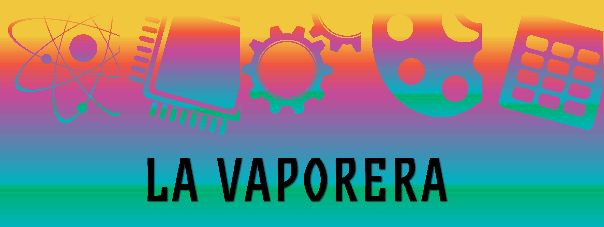

# La Vaporera: Ciencia y Arte en Español (2025)

    

"La Vaporera: Ciencia y Arte en Español" es un simposio organizando como parte del [Wisconsin Science Festival](https://www.wisconsinsciencefest.org/) para promocionar la ciencia y el arte en español. Su nombre viene de STEAM (Science, Technology, Engineering, Arts, Math) que significa "vapor" en español.

- **Cuándo:** Viernes 10 de Octubre, 2025 a las 3:30p CT
- **Dónde:** [Discovery Building](https://goo.gl/maps/AeCdxxd4Qx1BGH9k6)
- **Participación en línea:** El evento será transmitido en YouTube Live en [esta liga]().

## Eventos

| Hora | Tema | Detalles | Lugar |
| :--- | :--- | :---  | :--- |
| 3:30-4:30pm | Lotería: Charlas relámpago ⚡️ | Lista de temas [aquí](#charlas) | Orchard Room |
| 4:30-5:00pm | Cafecito ☕️ | | Afuera del Foro DeLuca |
| 5:00-6:00pm | Panel Plenario 🧪 💻 ⚙️ 🎨 🧮 | Lista de ponentes [aquí](#panel) | Foro DeLuca |
| 6:00-7:30pm | Película 🎥 | Award-winning Spanish-speaking movie [There are no bugs in winter](https://alfalfita-productions.github.io/there-are-no-bugs-in-winter/) | Foro DeLuca |

## Charlas Relámpago

**Lotería:** Durante las charlas relámpago, se va a jugar el juego de Lotería que es la versión es español del juego Bingo. Cada asistente recibirá una tarjeta con palabras clave que tiene que identificar de las charlas relámpago. Habrá premios para los ganadores!

| Ponente | Tema |
| :--- | :--- |
| Dante Fratta | 🌐 Internet-S o la idea de convertir las comunicaciones de Internet en un sensor global |
| Yoel Cortes-Pena	| ⚗️ Diseño de procesos quimicos sostenibles en BioSTEAM |
| Alejandro Ayala-Cortés | 🌱 Diseño experimental en el pretratamiento de biomasa para producción de biocombustibles |
| Virginia Lamas Meza | ☕ Síntesis y activación de biocarbón derivado de granos de café usados para la remoción dirigida de pesticidas neonicotinoides |
| Stephanie Simpson	| 📖 Escritores argentinos en la actualidad- lectura para divertirse |
| Natalia Rosario-Melendez	| 🦠 Cultivo de lenguajes: Como bacterias en un microbioma modelo se comunican |
| Adela Oliva Chavez | 🕷️ Spitabuloso: como la saliva de las garrapatas puede tener la respuesta en contra de la enfermedad de Lyme |
| Andres Cumsille | 🔬 Interacciones Bacterianas para el Descubrimiento de Productos Naturales |
| Ireide Calero Caballero | 🎨 El Grito del Guernica: Arte contra la guerra |
| Adriana Angel	| 🌎 LACIS: Latin American, Caribbean, and Iberian Studies |
| Yasmeen Orellana-Salazar | ☄️ Rayos cósmicos: el tiempo escrito en las rocas |
| Pablo Moreno-Yaeger | 🌋 Fuego y hielo: La relación entre los volcanes y las glaciaciones |
| Arturo Gamboa-Gonzalez | 🤖 Uso de IA para estimar perturbaciones ambientales en tiempo real para navegación |
| Mason Garza | 🧠 La relación entre el microbioma del intestino y la depresión |
| Ángel F. Adames Corraliza | 🌊 Qué son las ondas tropicales? |

## Panel Plenario

**Dinámica:** El panel plenario tendrá 5 ponentes (uno por cada tema de STEAM = Science, Technology, Engineering, Arts, Mathematics). Cada ponente dará una charla relámpago de 4 minutos y después empezará una sesión de preguntas de la audiencia.

| Tema | Ponente | Título |
| :--- | :--- | :---  |
| 🧪 Ciencia | [Helena Jaramillo Mesa](https://morgridge.org/profile/helena-jaramillo-mesa/) | Los mecanismos de producción de proteínas en virus de plantas |
| 💻 Tecnología | [Mayra Oyola](https://www.aos.wisc.edu/faculty/Oyola-Merced/) | Aviación y Turbulencia |
| ⚙️ Ingeniería | [Fernando Acosta-Perez](https://sites.google.com/wisc.edu/facostaperez/home) | Salud Interconectada: ¿Puede la Conectividad Interhospitalaria Mejorar Operaciones? |
| 🎨 Arte | |
| 🧮 Matemáticas | [Alejandra Quintos](https://alejandraquintos.com/) | Modelando Tiempos Aleatorios con Fases |

## Más información

**¿Dónde está el Orchard Room?**
El Orchard Room está en el 3er piso del [Discovery Building](https://goo.gl/maps/AeCdxxd4Qx1BGH9k6). Se puede acceder a este salón del elevador detrás de Aldo's Café.

**¿Dónde está el Foro DeLuca?**
El Foro DeLuca está en el 1er piso del [Discovery Building](https://goo.gl/maps/AeCdxxd4Qx1BGH9k6) enfrente de los elevadores.