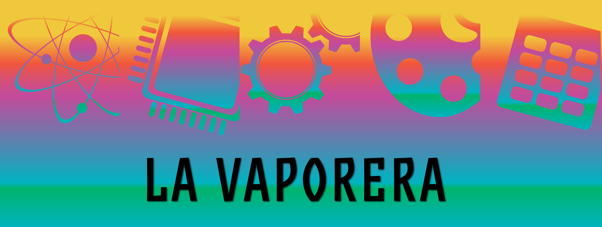

# La Vaporera: Ciencia y Arte en Español

  

"La Vaporera: Ciencia y Arte en Español" es un simposio organizando como parte del [Wisconsin Science Festival](https://www.wisconsinsciencefest.org/) para promocionar la ciencia y el arte en español. Su nombre viene de STEAM (Science, Technology, Engineering, Arts, Math) que significa "vapor" en español.

  
  

    <a href="2026.html"
       style="display:inline-block; background:#c8102e; color:#fff; font-weight:700;
              font-size:1rem; padding:.75rem 2rem; border-radius:4px; text-decoration:none;
              box-shadow:0 4px 16px rgba(200,16,46,0.25);">
      → October 9, 2026 · Café Coda · Details here
    </a>
  

---

### Check out other relevant events:

  

    

      
🌎 Celebrating Latinx contributions in STEAM!

    

    

      

        The <a href="https://solislemuslab.github.io/latinx-uwmadison/">Celebrating Latinx contributions in STEAM</a> symposium took place in October 2023 and October 2024 in the DeLuca forum in the Discovery Building on Latinx contributions in STEAM from campus community.
      

      <a href="https://solislemuslab.github.io/latinx-uwmadison/"
         style="color:#c8102e; font-size:0.9rem; font-weight:600; text-decoration:none;">→ Website</a>
    

  

  

    

      
🎙️ Don't miss El Zoominario!

    

    

      

        Check out the monthly seminar series <a href="https://solislemuslab.github.io/el-zoominario/">El Zoominario</a> with talks in English and Spanish, all recorded and available in the <a href="https://www.youtube.com/playlist?list=PL1AfUDnwvYbOA9rfrvyA2nR9SR0VYbklx">El Zoominario YouTube playlist</a>.
      

      

        
      

      <a href="https://solislemuslab.github.io/el-zoominario/"
         style="color:#c8102e; font-size:0.9rem; font-weight:600; text-decoration:none;">→ Website</a>
      &nbsp;&nbsp;
      <a href="https://www.youtube.com/playlist?list=PL1AfUDnwvYbOA9rfrvyA2nR9SR0VYbklx"
         style="color:#c8102e; font-size:0.9rem; font-weight:600; text-decoration:none;">→ YouTube</a>
    

  

---

# Thanks!

The event could not have been possible without the planning and financial support of:

  <a href="https://wid.wisc.edu/" style="background:#fff5f5; border:1px solid #e8c8c8; border-radius:20px; padding:0.4rem 1rem; color:#c8102e; text-decoration:none; font-size:0.9rem; font-weight:500;">Wisconsin Institute for Discovery</a>
  <a href="https://www.wisconsinsciencefest.org/" style="background:#fff5f5; border:1px solid #e8c8c8; border-radius:20px; padding:0.4rem 1rem; color:#c8102e; text-decoration:none; font-size:0.9rem; font-weight:500;">Wisconsin Science Festival</a>
  <a href="https://dsi.wisc.edu/" style="background:#fff5f5; border:1px solid #e8c8c8; border-radius:20px; padding:0.4rem 1rem; color:#c8102e; text-decoration:none; font-size:0.9rem; font-weight:500;">The Data Science Institute</a>

especially Jo Handelsman, Laura Red Eagle, Sheila O'Brien and Patricia Pointer from the Wisconsin Institute for Discovery.

La Vaporera is open to all! [UW non-discrimination statement](https://compliance.wisc.edu/eo-complaint/)

---

# Meet the organizer

  

    
  

  

    
Claudia Solís-Lemus

    

      Originally from Mexico City, Claudia Solís-Lemus is an associate professor at the
      <a href="https://wid.wisc.edu/">Wisconsin Institute for Discovery</a> and the
      <a href="https://plantpath.wisc.edu/">Department of Plant Pathology</a> at the
      <a href="http://www.wisc.edu">University of Wisconsin-Madison</a>.  
      Pronouns: she/her ·
      <a href="https://namedrop.io/claudiasolislemus" style="color:#c8102e;">Name pronunciation</a>
    

    

      <a href="https://solislemuslab.github.io/" style="color:#c8102e; font-size:0.9rem; font-weight:600; text-decoration:none;">→ Lab website</a>
      |
      <a href="https://scholar.google.com/citations?user=GrUypj8AAAAJ&hl=en&oi=ao" style="color:#c8102e; font-size:0.9rem; font-weight:600; text-decoration:none;">→ Google Scholar</a>
      |
      <a href="https://github.com/crsl4" style="color:#c8102e; font-size:0.9rem; font-weight:600; text-decoration:none;">→ GitHub</a>
      |
      <a href="https://solislemuslab.github.io//pages/people.html" style="color:#c8102e; font-size:0.9rem; font-weight:600; text-decoration:none;">→ Contact Info</a>
    

  

