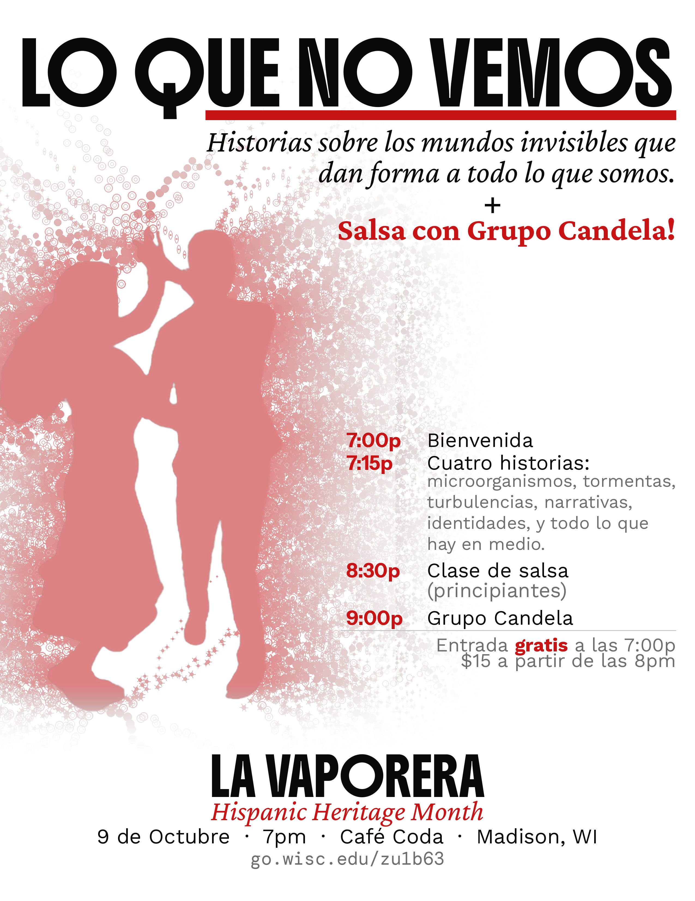

# La Vaporera: Ciencia y Arte en Español

  

  Ciencia · Arte · Salsa · En Español

  <a href="2026.html"
     style="display:inline-block; background:#c8102e; color:#fff; font-weight:700;
            font-size:1rem; padding:.75rem 2rem; border-radius:4px; text-decoration:none;
            box-shadow:0 4px 16px rgba(200,16,46,0.25);">
    → Edición 2026: 9 de Octubre · Café Coda
  </a>

---

**"La Vaporera: Ciencia y Arte en Español"** es un simposio organizado como parte del [Wisconsin Science Festival](https://www.wisconsinsciencefest.org/) para celebrar la ciencia y el arte en español. Su nombre viene de STEAM (Science, Technology, Engineering, Arts, Math) — que significa **"vapor"** en español.

Cada año reunimos a académicas y académicos latinos para compartir sus historias de investigación con la comunidad, sin barreras de idioma y con la energía de la música en vivo.

---

## Otros eventos recomendados

  

    

      
🎙️ El Zoominario

    

    

      

        Serie mensual de seminarios con charlas en inglés y español, todos grabados y disponibles en YouTube.
      

      <a href="https://solislemuslab.github.io/el-zoominario/"
         style="color:#c8102e; font-size:0.9rem; font-weight:600; text-decoration:none;">→ Website</a>
      &nbsp;&nbsp;
      <a href="https://www.youtube.com/playlist?list=PL1AfUDnwvYbOA9rfrvyA2nR9SR0VYbklx"
         style="color:#c8102e; font-size:0.9rem; font-weight:600; text-decoration:none;">→ YouTube</a>
    

  

  

    

      
🌎 Latinx Contributions in STEAM

    

    

      

        Simposio celebrado en octubre de 2023 y 2024 en el Discovery Building, destacando contribuciones latinas en STEAM.
      

      <a href="https://solislemuslab.github.io/latinx-uwmadison/"
         style="color:#c8102e; font-size:0.9rem; font-weight:600; text-decoration:none;">→ Website</a>
    

  

---

## Gracias

Este evento no sería posible sin el apoyo de:

  <a href="https://wid.wisc.edu/" style="background:#fff5f5; border:1px solid #e8c8c8; border-radius:20px; padding:0.4rem 1rem; color:#c8102e; text-decoration:none; font-size:0.9rem; font-weight:500;">Wisconsin Institute for Discovery</a>
  <a href="https://www.wisconsinsciencefest.org/" style="background:#fff5f5; border:1px solid #e8c8c8; border-radius:20px; padding:0.4rem 1rem; color:#c8102e; text-decoration:none; font-size:0.9rem; font-weight:500;">Wisconsin Science Festival</a>
  <a href="https://dsi.wisc.edu/" style="background:#fff5f5; border:1px solid #e8c8c8; border-radius:20px; padding:0.4rem 1rem; color:#c8102e; text-decoration:none; font-size:0.9rem; font-weight:500;">Data Science Institute</a>

Agradecemos especialmente a Jo Handelsman, Laura Red Eagle, Sheila O'Brien y Patricia Pointer del Wisconsin Institute for Discovery.

La Vaporera es abierta a toda la comunidad. [Declaración de no discriminación de UW–Madison](https://compliance.wisc.edu/eo-complaint/)

---

## La organizadora

  

    
  

  

    
Claudia Solís-Lemus

    

      Profesora Asociada · Wisconsin Institute for Discovery & Department of Plant Pathology, UW–Madison 
      Originaria de Ciudad de México · she/her ·
      <a href="https://namedrop.io/claudiasolislemus" style="color:#c8102e;">pronunciación</a>
    

    

      <a href="https://solislemuslab.github.io/" style="color:#c8102e; font-size:0.9rem; font-weight:600; text-decoration:none;">→ Lab website</a>
      |
      <a href="https://scholar.google.com/citations?user=GrUypj8AAAAJ&hl=en&oi=ao" style="color:#c8102e; font-size:0.9rem; font-weight:600; text-decoration:none;">→ Google Scholar</a>
      |
      <a href="https://github.com/crsl4" style="color:#c8102e; font-size:0.9rem; font-weight:600; text-decoration:none;">→ GitHub</a>
      |
      <a href="https://solislemuslab.github.io//pages/people.html" style="color:#c8102e; font-size:0.9rem; font-weight:600; text-decoration:none;">→ Contacto</a>
    

  

