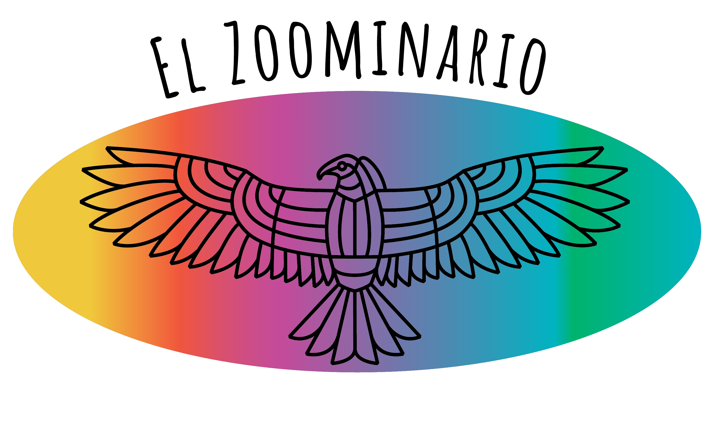

# La Vaporera: Ciencia y Arte en Español

"La Vaporera: Ciencia y Arte en Español" es un simposio organizando como parte del [Wisconsin Science Festival](https://www.wisconsinsciencefest.org/) para promocionar la ciencia y el arte en español. Su nombre viene de STEAM (Science, Technology, Engineering, Arts, Math) que significa "vapor" en español.

{: .note }
Check out other relevant events:

**Celebrating Latinx contributions in STEAM!**
The "Celebrating Latinx contributions in STEAM" symposium took place in October 2023 and October 2024 in the DeLuca forum in the [Discovery Building](https://goo.gl/maps/AeCdxxd4Qx1BGH9k6) with contributions from campus community about Latinx contributions in STEAM. 

**Don't miss El Zoominario!**
Check out the monthly seminar series [El Zoominario](https://solislemuslab.github.io/el-zoominario/) with talks in English and Spanish, all recorded and avaliable 
in the [El Zoominario YouTube playlist](https://www.youtube.com/playlist?list=PL1AfUDnwvYbOA9rfrvyA2nR9SR0VYbklx). 

    

# Thanks!

The event could not have been possible without the planning and financial support of:

- [Wisconsin Institute for Discovery](https://wid.wisc.edu/), especially Laura Red Eagle and Patricia Pointer
- [CALS Office of Diversity, Equity and Inclusion](https://admin.cals.wisc.edu/offices/dei/)
- [The Data Science Institute](https://dsi.wisc.edu/)

# Meet the organizer

Originally from Mexico City, Claudia Sol&iacute;s-Lemus is an associate professor at the [Wisconsin Institute for Discovery](https://wid.wisc.edu/) and the [Department of Plant Pathology](https://plantpath.wisc.edu/) at the [University of Wisconsin-Madison](http://www.wisc.edu). 

    

        

            
        

        

            Pronouns: she/her  
            <a href="https://namedrop.io/claudiasolislemus">Name pronunciation</a> 
            <a href="https://solislemuslab.github.io/">Lab website</a> 
            <a href="https://scholar.google.com/citations?user=GrUypj8AAAAJ&hl=en&oi=ao">Google scholar</a> 
            <a href="https://github.com/crsl4">GitHub</a> 
            <a href="https://solislemuslab.github.io//pages/people.html">Contact Info</a> 
        

    

 

